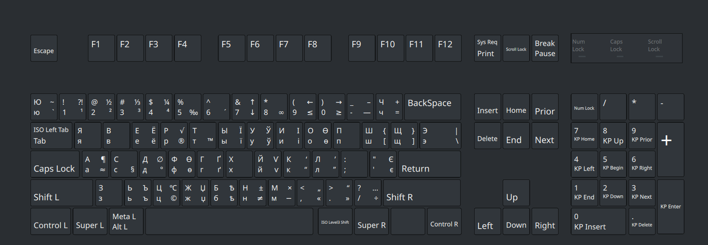

# Extended Cyrillic Phonetic Keyboard Layout

An extended Cyrillic phonetic keyboard layout that also supports most Cyrillic letters from various alphabets.

## Installation

Run `install/install` with superuser privileges:

```sh  
sudo install/install
```

It should take care of the installation. If any issues arise, you will need to manually specify the path to the XKB directory and run the script with a command-line parameter:

```sh  
sudo install/install -d /usr/local/X11/xkb
```

## Current Layout



## TODO

* Add new symbols
